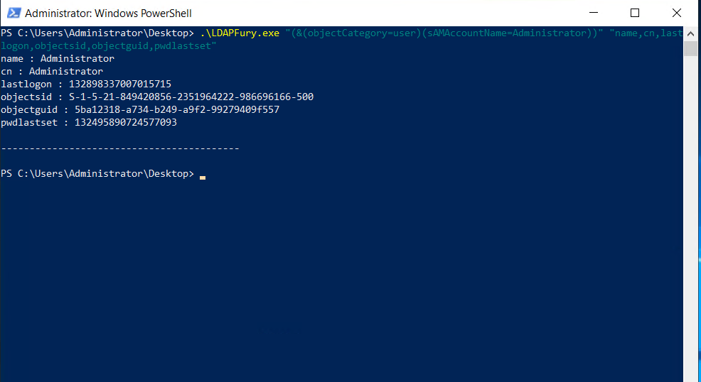

# LDAPFury

## Usage

Run the binary with two arguments:

1) First argument is the ldap query that you want to make. Ex: `(&(objectCategory=group))`
2) Second argument is the object attribute that you want to query from the the object `name,CN,lastlogon`

### Example Usage

```
.\LDAPFury.exe "(&(objectCategory=user))" "name,cn,lastlogon,objectsid,pwdlastset"
```


